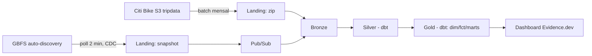

# BikeFlow

Plataforma de dados para mobilidade compartilhada (Citi Bike NYC). Pergunta de
negócio: como identificar desequilíbrios na distribuição de bicicletas entre
estações e apoiar decisões de redistribuição da frota.

O diferencial: comparar a variação observada de bicicletas por estação (via
GBFS) com a variação explicada por viagens (retiradas − devoluções). A
diferença é rebalanceamento manual (caminhão) ou bicicleta com defeito — dá
pra inferir a operação de redistribuição que a empresa já executa, sem ter
acesso aos dados internos dela.

## Por que roda 100% local

O projeto não tem acesso a Cloud Billing (sem cartão de crédito, sem PIX de
pré-pagamento liberado). Em vez de esperar isso destravar, a arquitetura usa
os **SDKs oficiais do Google** (`google-cloud-storage`, `google-cloud-pubsub`)
apontando para **emuladores oficiais** — não mocks. A troca entre emulador e
GCP real é uma variável de ambiente, não uma reescrita de código. Ver
[`docs/adr/0001-emuladores-vs-gcp-pago.md`](docs/adr/0001-emuladores-vs-gcp-pago.md).

| Papel | Local (hoje, R$ 0) | GCP (quando destravar) | O código muda? |
|---|---|---|---|
| Object storage | `fsouza/fake-gcs-server` | Cloud Storage | **Não** — só `STORAGE_EMULATOR_HOST` |
| Mensageria | Pub/Sub emulator (oficial) | Pub/Sub | **Não** — só `PUBSUB_EMULATOR_HOST` |
| Warehouse | DuckDB | BigQuery | Target do dbt |
| Orquestração | Airflow (docker-compose) | Cloud Composer | **Não** — DAG idêntica |
| Dashboard | Evidence.dev (estático) | Looker Studio | Recriado |

## Arquitetura de dados

Medalhão: **landing** (zip bruto/snapshot GBFS, imutável) → **bronze**
(tipado, 1:1 com a fonte) → **silver** (dbt: dedupe, UTC, chave de join
estação↔viagem resolvida) → **gold** (dbt: dimensional Kimball + marts de
decisão). Detalhe completo, incluindo as falhas encontradas no plano original
e o porquê de cada correção, em [`docs/PLAN.md`](docs/PLAN.md).



## Como rodar (sem conta GCP)

Requisitos: Python 3.11 ou 3.12, Docker + Compose v2.

```bash
make install   # cria o venv e instala o pacote + deps de dev
make up        # sobe fake-gcs-server + Pub/Sub emulator (espera ficarem saudáveis)
make lint      # ruff + ruff format --check + mypy
make test-all  # testes de integração contra os emuladores reais
make down      # derruba os emuladores
```

Veja todos os comandos com `make help`.

## Status

**Fase 0 (Fundação) concluída.** Esqueleto do projeto, emuladores locais,
clientes de storage/mensageria implementados contra os SDKs oficiais,
testes de integração e CI no GitHub Actions.

Roadmap completo por fase (cada uma vira uma tag Git) em
[`docs/PLAN.md`](docs/PLAN.md).

## Licença dos dados

Nenhum dado bruto ou derivado do Citi Bike é versionado neste repositório —
a licença do Citi Bike proíbe redistribuir os dados como dataset standalone.
